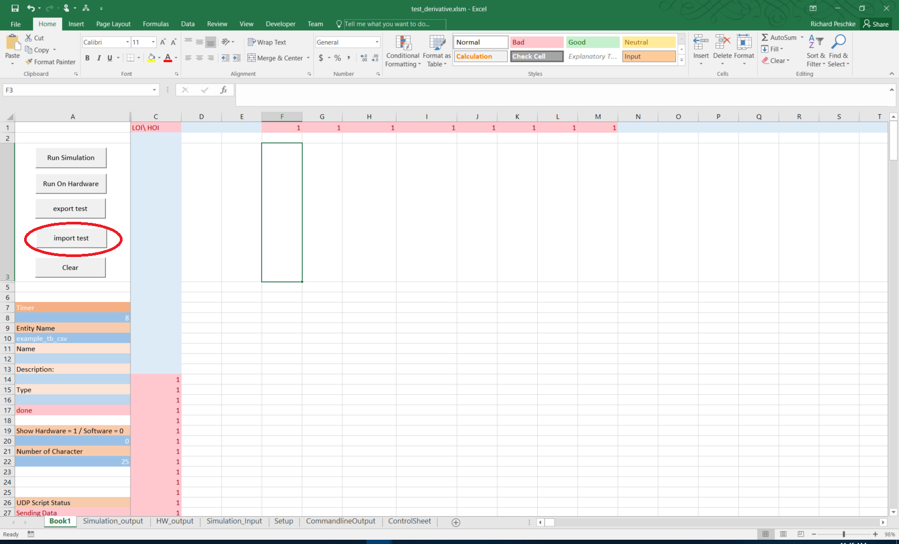
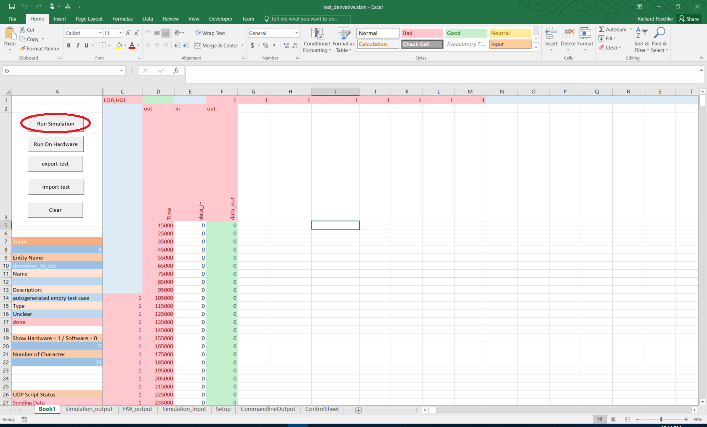
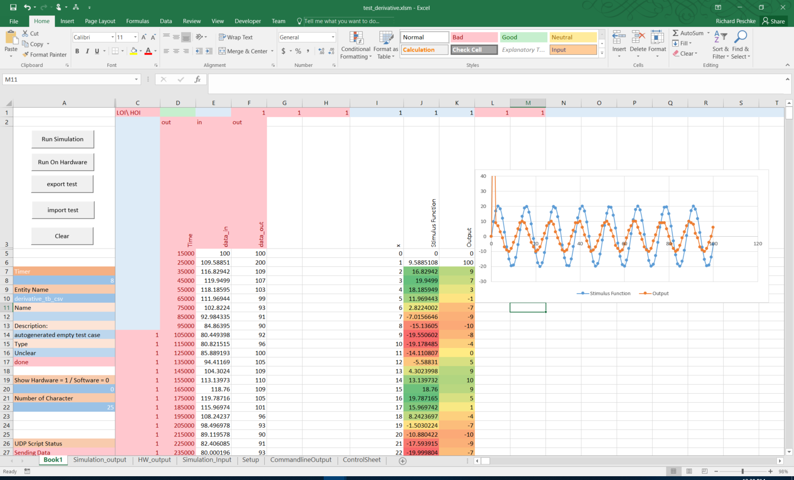
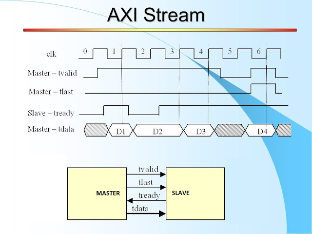
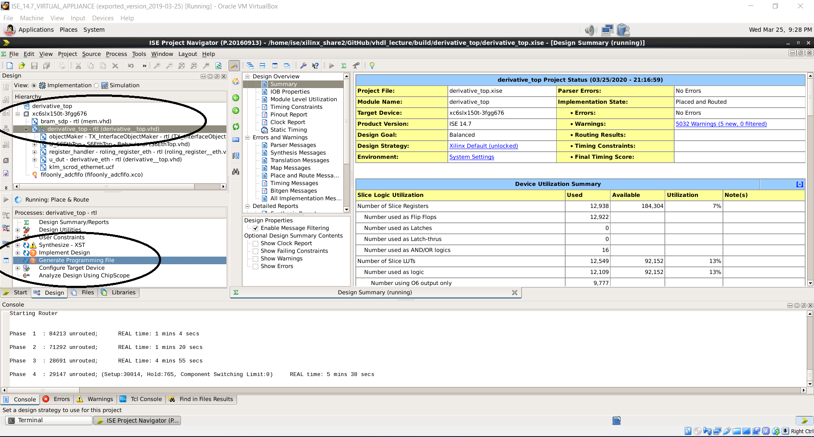
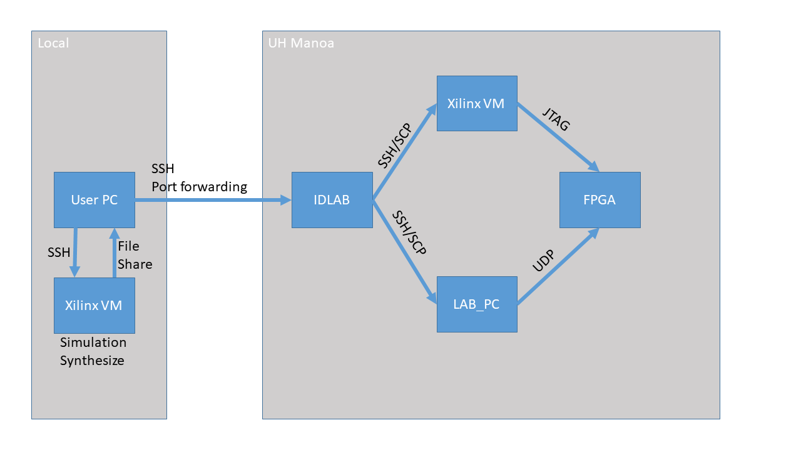
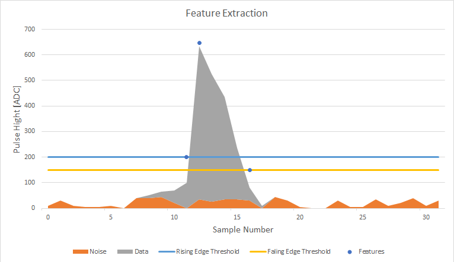
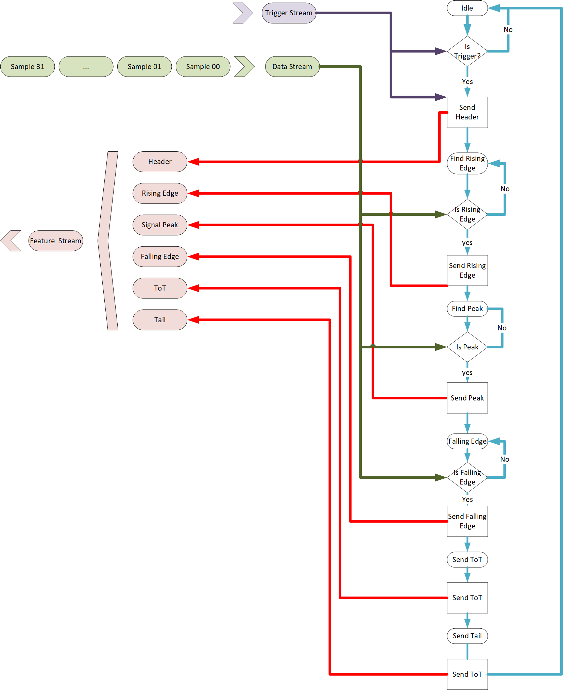

# IDLAB VHDL Lecture


## Installing Python

In order to run the python scripts you need to have python3 installed.

requirements:

- python3
- pip3
- pandas
- xlrd

```bash
# PC BASH
sudo apt-get update
sudo apt-get upgrade
sudo apt-get install python3
sudo apt-get install python3-pip
pip3 install pandas
pip3 install xlrd

```

If you are using windows/wsl you need to have these packages installed on both (windows/wsl).

On windows make sure python and pip is in the path.


## Installation  ISE

### cloning
First install the ISE Virtual Box on your PC, then Connect a shared folder from your HOST PC to the Virtual Machine.

Then Clone the repository in the folder that is shared between the host system and the Virtual machine.

Example:

PC = Host PC
VM = Virtual Machine 

PC /mnt/C/users/myUser/Documents/xilings   => VM /user/ise/xilings 

```bash
#PC:/mnt/C/users/myUser/Documents/xilings 
git clone --recursive https://github.com/RPeschke/vhdl_lecture.git
```

side note: 
If you have forgotten to use ```--recursive``` you have initizilise the submodules by using:

```bash
#PC:/mnt/C/users/myUser/Documents/xilings/vhdl_lecture
git submodule update --init --recursive
```

### setting up the build system

The folder ```vhdl_build_system``` contains a build system which allows you to easly create project for ISE.

It needs to be setup. That means it needs the following information.


| parameter | Descritption| default |
|---|----| ---| 
|path | Path to where the build system should be located | build/ |
| ssh | ssh configuration used for running the Xilinx programs remotly |  None  | 
| remotePath | Path on the remote machine that has the Xilinx programs | None | 
|protoBuild | Path to the proto build files | protoBuild/ |
| RunPcSsh | ssh configuration used for running the firmware on actual Hardware | labpc |
| RunPcRemote | Path on the remote running PC | /home/belle2/Documents/tmp/ |
| jtag_PC | Path on the remote jtag PC | lab_xilinx"|


In order to run the simulation we only need to connect to the Xilinx VM. This can be done by using the following command:


```bash
#PC:/mnt/C/users/myUser/Documents/xilings/vhdl_lecture
python3 ./vhdl_build_system/vhdl_make_build_system.py --remotePath /user/ise/xilings/vhdl_lecture --ssh xilinx
```


This command should run through without any printouts. Once it is done you should have new files in the current Folder.

- build_implementation.sh 
- build_synt.sh 
- jtag.sh 
- make_implementation.sh 
-  make_simulation.sh 
-  make_test_bench.sh  
-  run_on_hardware.sh
-  run_simulation.sh        
-  run_test_cases.sh        
-  startNewRun.sh         
-  update_test_cases.sh


For now we will only focus on the following scripts:

-  make_test_bench.sh  
-  make_simulation.sh 
-  run_simulation.sh        

## Using the Build System


The Build system works in the Following steps:

1. Make Test Bench
2. Make Simulation 
3. Run Simulation

### Make Test Bench:

In order to create a new Test Bench for the Entity you want to test you have to run the following command:

```bash 
#PC:/mnt/C/users/myUser/Documents/xilings/vhdl_lecture
./make_test_bench.sh Derivative  session_01/test_derivative
```

This script will end with:
```
generated test bench file derivative_tb_csv
``` 

The Target folder session_01/test_derivative should now contain the following files:
```bash
#PC:/mnt/C/users/myUser/Documents/xilings/vhdl_lecture
ls session_01/test_derivative
```

- derivative_IO_pgk.vhd  
- derivative__top.vhd 
- derivative_tb_csv.testcase.xml 
- derivative_tb_csv.vhd


### Make Simulation:

Now we can create a project/build file for this project by executing the following command:

```bash
#PC:/mnt/C/users/myUser/Documents/xilings/vhdl_lecture
./make_simulation.sh derivative_tb_csv
```

The newly created project file can be view in ```build/derivative_tb_csv/derivative_tb_csv.prj```.It should contain all file requiered to run the project. For This example the file should look like this:


```
vhdl work "../.././session_01/test_derivative/derivative_tb_csv.vhd"
vhdl work "../.././session_01/Derivative.vhd"
vhdl work "../.././vhdl_csv_io/e_csv_read_file.vhd"
vhdl work "../.././vhdl_csv_io/e_csv_write_file.vhd"
vhdl work "../.././vhdl_csv_io/ClockGenerator.vhd"
vhdl work "../.././vhdl_csv_io/type_conversions_helper.vhd"
vhdl work "../.././vhdl_csv_io/CSV_UtilityPkg.vhd"
vhdl work "../.././session_01/test_derivative/derivative_IO_pgk.vhd"
vhdl work "../.././vhdl_csv_io/text_io_import_csv.vhd"
vhdl work "../.././vhdl_csv_io/text_io_export_csv.vhd"
```


### Run Simulation:
you can run the simulation by using the following script:

```bash
#PC:/mnt/C/users/myUser/Documents/xilings/vhdl_lecture
./run_simulation.sh derivative_tb_csv
```

It will first compile the simulation and then run it. It uses CSV Files as a stimulus to the simulation. If you run it without any imput file specified it will just rerun the last one given to it. 

If you want to use isim to investigate the simulation you have to do this from the within the VM.


1. Open a terminal inside the VM. 
1. Navigate to the build Folder
1. Execute ```./run_only_with_gui.sh```

Example:

```Bash
#VM
cd /user/ise/xilings/vhdl_lecture/session_01/test_derivative
./run_only_with_gui.sh
```

If you have just created the test bench and did not provide a stimulus file it will use a auto generated stimulus file which is more or less empty. Therefore you only see two clock cycles before the simulation stops. 


## Using the Excel File


### Loading a Test case



Currently there is a bug which means you have to load the testcase twice to succesfully load it.


### Running a Test

Once the test case is loaded you can run the test. For this you just have to press the Run_simulation Button.





### Visualizing Data

For the excel sheet it is important that the Autogenerated Part of the file does not get changed. The rest can be modified as needed. This means for example we can Create a sine wave input to the simulation simply by adding new colums to the Excel file.




## Session 01 

The First Example is a simple entity which make a derivative of the input.

```vhdl
entity Derivative is
    port (
        clk : std_logic;
        data_in : std_logic_vector(15 downto 0); 
        data_out : out std_logic_vector(15 downto 0)
    );
end entity Derivative;

architecture rtl of Derivative is
    signal buff  : std_logic_vector(15 downto 0) := (others => '0');
begin
    
    
process(clk)
begin
    if rising_edge(clk) then
        data_out <= data_in - buff + 100;
        buff <= data_in ;
    end if;
end process;

    
end architecture rtl;
```


The entity has 3 Ports. One for the clk, one for the data input and one for the data output. It expects that all the data it reaceives is valid and correct and expect the the output is always read. 

## Session 02


In Praxis entities need some sort of handshake to communicated with each other to make sure that the data was trasmitted correctly.

For this one way of doing this is Called the Axi Stream Interface.



It consists of three (four "last" is optional) signals for the communication. 

The Key feature about this interace is that the information if the data is valid and is being read only depends on information avalible at this exact clock cycle. There is no need to buffer the signals from preveous clock cycles. 

In praxis that means for the Sender /Master side.

If Valid is High And ready is High the slave has received the data and the Master is ready to send new Data. 

On the slave Side if valid and ready is high the slave has to use the data. At this time there is no way of not using this data right now. If the slave cannot use the data the two entities will get out of sync and the package is lost. That means at the time the  slave raises the ready signal it must be able to receive the data. 

### Task

In the folder "session_02" is a template of an entity which uses the axi stream interface. 

- Build a test bench for the "axi_derivative"  entity
- Modify the process block of axi_derivative to make the derivative of the input stream
- Simulate the entity 


## session_05 Run On Hardware

For this we going to revisit the example from session_01. In this we had a simple derivative entity. Now we want to compile this entity into a bit file. For these we first need a top level file that handles the connecting ports. 

for this we can use the make test bench command again. 

```bash
./make_test_bench.sh Derivative session_01/test_derivative
```


Besides the file that we already know (derivative_tb_csv.vhd) it also creates a top level file (derivative__top.vhd) inside this file is the top level entity.

now you can create a ISE project by running

```bash
./make_simulation.sh derivative_top
```

and then:
```bash
./make_implementation.sh derivative_top firmware-ethernet/constraints/klm_scrod_ethernet.ucf
```

after this you will find a new .xise file in at 

```
build/derivative_top/
```

open the file in ISE. and then click on generate bitfile 



The Bit file sould be generated without errors. 



## Session 06: State Machine 

In this example the working of a state machine is demonstrated. The scenario for this excersice is an wave form sampling ASIC for which we want to write an entity that does feature extraction. 

First of all what do we mean by feature extraction and why is that useful? Lets asume that we have an ASIC which can readout the waveform of an Photo Mulitplier (PMT) which is connected to a szintilatior bar. For our experiment only very few features of this waveform are actually intressting. 

- Signal High 
- Time over Threshold (ToT)
- Cummulative Signal Hight
- Timing Rising edge 
- Timing Faling edge
- Timing Peak 


By reducing the waveform to only two pices of information it allows to readout the detector at a much higher speed than without this. 

For this session the goal is to create an entity which does the feature extraction and packaging of the data. 

The input data will be one data input stream and one trigger input stream. The output of the entity is one data stream which contains a header which contains information such as run number, trigger number and asic number and a body which contains a list of all peaks (timing/Hight) that happend within a certain time after the trigger. 




The next picture shows a simple abstraction of the State Machine which handles the feature extraction and packaging


