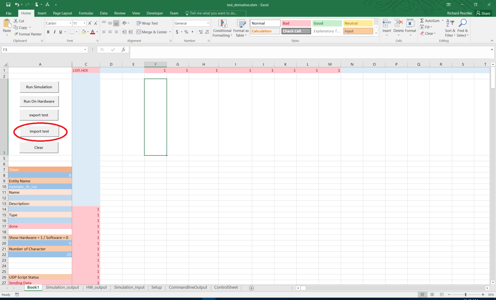
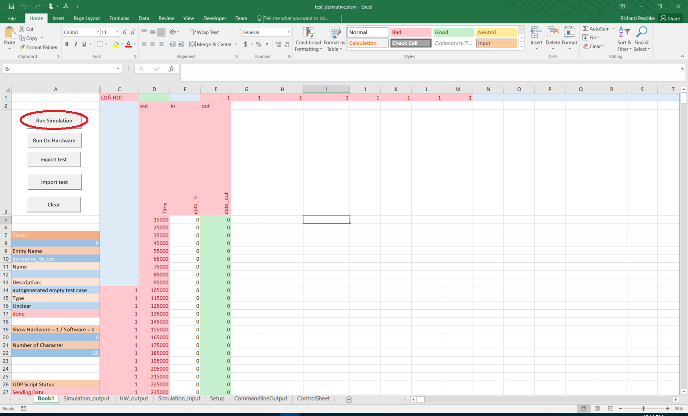
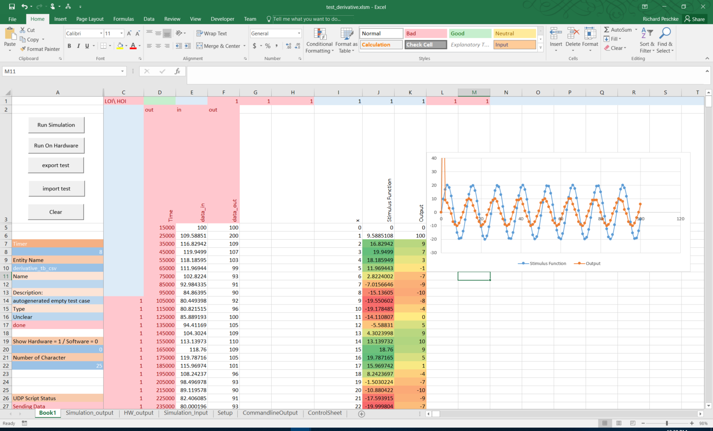

# IDLAB VHDL Lecture


## Installing Python

In order to run the python scripts you need to have python3 installed.

requirements:

- python3
- pip3
- pandas
- xlrd

```bash
# PC BASH
sudo apt-get update
sudo apt-get upgrade
sudo apt-get install python3
sudo apt-get install python3-pip
pip3 install pandas
pip3 install xlrd

```

If you are using windows/wsl you need to have these packages installed on both (windows/wsl).

On windows make sure python and pip is in the path.


## Installation  ISE

### cloning
First install the ISE Virtual Box on your PC, then Connect a shared folder from your HOST PC to the Virtual Machine.

Then Clone the repository in the folder that is shared between the host system and the Virtual machine.

Example:

PC = Host PC
VM = Virtual Machine 

PC /mnt/C/users/myUser/Documents/xilings   => VM /user/ise/xilings 

```bash
#PC:/mnt/C/users/myUser/Documents/xilings 
git clone --recursive https://github.com/RPeschke/vhdl_lecture.git
```

side note: 
If you have forgotten to use ```--recursive``` you have initizilise the submodules by using:

```bash
#PC:/mnt/C/users/myUser/Documents/xilings/vhdl_lecture
git submodule update --init --recursive
```

### setting up the build system

The folder ```vhdl_build_system``` contains a build system which allows you to easly create project for ISE.

It needs to be setup. That means it needs the following information.


| parameter | Descritption| default |
|---|----| ---| 
|path | Path to where the build system should be located | build/ |
| ssh | ssh configuration used for running the Xilinx programs remotly |  None  | 
| remotePath | Path on the remote machine that has the Xilinx programs | None | 
|protoBuild | Path to the proto build files | protoBuild/ |
| RunPcSsh | ssh configuration used for running the firmware on actual Hardware | labpc |
| RunPcRemote | Path on the remote running PC | /home/belle2/Documents/tmp/ |
| jtag_PC | Path on the remote jtag PC | lab_xilinx"|


In order to run the simulation we only need to connect to the Xilinx VM. This can be done by using the following command:


```bash
#PC:/mnt/C/users/myUser/Documents/xilings/vhdl_lecture
python3 ./vhdl_build_system/vhdl_make_build_system.py --remotePath /user/ise/xilings/vhdl_lecture --ssh xilinx
```


This command should run through without any printouts. Once it is done you should have new files in the current Folder.

- build_implementation.sh 
- build_synt.sh 
- jtag.sh 
- make_implementation.sh 
-  make_simulation.sh 
-  make_test_bench.sh  
-  run_on_hardware.sh
-  run_simulation.sh        
-  run_test_cases.sh        
-  startNewRun.sh         
-  update_test_cases.sh


For now we will only focus on the following scripts:

-  make_test_bench.sh  
-  make_simulation.sh 
-  run_simulation.sh        

## Using the Build System


The Build system works in the Following steps:

1. Make Test Bench
2. Make Simulation 
3. Run Simulation

### Make Test Bench:

In order to create a new Test Bench for the Entity you want to test you have to run the following command:

```bash 
#PC:/mnt/C/users/myUser/Documents/xilings/vhdl_lecture
./make_test_bench.sh Derivative  session_01/test_derivative
```

This script will end with:
```
generated test bench file derivative_tb_csv
``` 

The Target folder session_01/test_derivative should now contain the following files:
```bash
#PC:/mnt/C/users/myUser/Documents/xilings/vhdl_lecture
ls session_01/test_derivative
```

- derivative_IO_pgk.vhd  
- derivative__top.vhd 
- derivative_tb_csv.testcase.xml 
- derivative_tb_csv.vhd


### Make Simulation:

Now we can create a project/build file for this project by executing the following command:

```bash
#PC:/mnt/C/users/myUser/Documents/xilings/vhdl_lecture
./make_simulation.sh derivative_tb_csv
```

The newly created project file can be view in ```build/derivative_tb_csv/derivative_tb_csv.prj```.It should contain all file requiered to run the project. For This example the file should look like this:


```
vhdl work "../.././session_01/test_derivative/derivative_tb_csv.vhd"
vhdl work "../.././session_01/Derivative.vhd"
vhdl work "../.././vhdl_csv_io/e_csv_read_file.vhd"
vhdl work "../.././vhdl_csv_io/e_csv_write_file.vhd"
vhdl work "../.././vhdl_csv_io/ClockGenerator.vhd"
vhdl work "../.././vhdl_csv_io/type_conversions_helper.vhd"
vhdl work "../.././vhdl_csv_io/CSV_UtilityPkg.vhd"
vhdl work "../.././session_01/test_derivative/derivative_IO_pgk.vhd"
vhdl work "../.././vhdl_csv_io/text_io_import_csv.vhd"
vhdl work "../.././vhdl_csv_io/text_io_export_csv.vhd"
```


### Run Simulation:
you can run the simulation by using the following script:

```bash
#PC:/mnt/C/users/myUser/Documents/xilings/vhdl_lecture
./run_simulation.sh derivative_tb_csv
```

It will first compile the simulation and then run it. It uses CSV Files as a stimulus to the simulation. If you run it without any imput file specified it will just rerun the last one given to it. 

If you want to use isim to investigate the simulation you have to do this from the within the VM.


1. Open a terminal inside the VM. 
1. Navigate to the build Folder
1. Execute ```./run_only_with_gui.sh```

Example:

```Bash
#VM
cd /user/ise/xilings/vhdl_lecture/session_01/test_derivative
./run_only_with_gui.sh
```

If you have just created the test bench and did not provide a stimulus file it will use a auto generated stimulus file which is more or less empty. Therefore you only see two clock cycles before the simulation stops. 


## Using the Excel File


### Loading a Test case



Currently there is a bug which means you have to load the testcase twice to succesfully load it.


## Running a Test

Once the test case is loaded you can run the test. For this you just have to press the Run_simulation Button.





## Visualizing Data

For the excel sheet it is important that the Autogenerated Part of the file does not get changed. The rest can be modified as needed. This means for example we can Create a sine wave input to the simulation simply by adding new colums to the Excel file.

